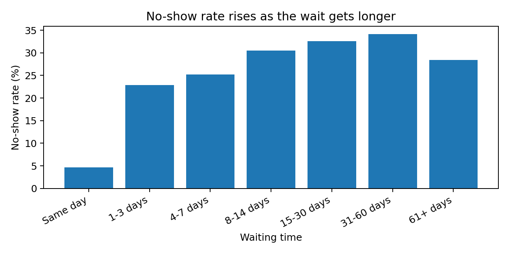
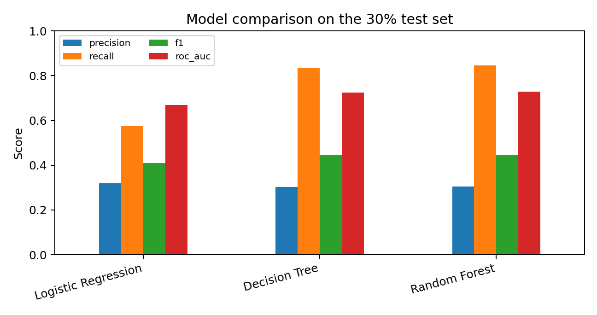
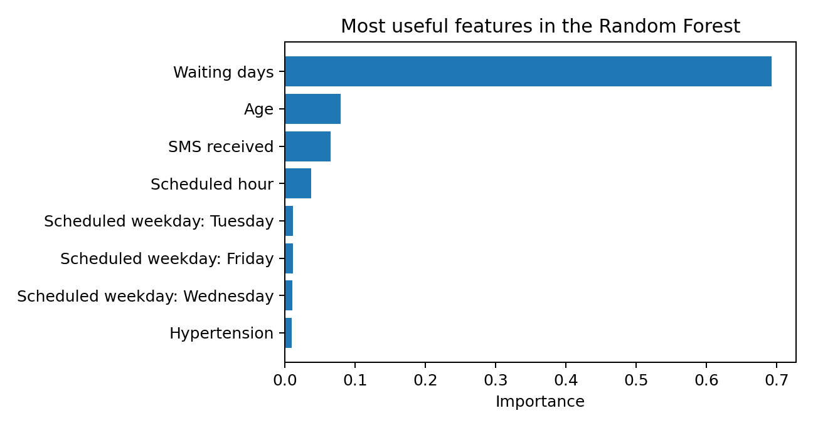

# Patient Appointment No-Show Prediction

**Applied Analytics & AI Mini Project**

**Abdolhossein (Benjamin) Ayoubi**  
Master's Degree Programme in Smart Industry  
Metropolia University of Applied Sciences, 2026

**Interactive dashboard:** https://hosseinayoubi.github.io/Report/  
**Project repository:** https://github.com/hosseinayoubi/Report

This repository contains the data, notebook, figures, and interactive dashboard for my Applied Analytics & AI mini project. The README follows the same structure, numbers, and conclusions as the final Word report.

## Table of Contents

1. [Project Overview and Scope](#1-project-overview-and-scope)
2. [Problem and Success Criteria](#2-problem-and-success-criteria)
3. [Data and Preparation](#3-data-and-preparation)
4. [Exploratory Analysis](#4-exploratory-analysis)
5. [Method / Workflow](#5-method--workflow)
6. [Results](#6-results)
7. [Discussion and Interpretation](#7-discussion-and-interpretation)
8. [Governance, Privacy, and Security](#8-governance-privacy-and-security)
9. [Conclusion](#9-conclusion)
10. [References](#10-references)

## 1. Project Overview and Scope

This project looks at a simple operational problem in healthcare: some patients miss scheduled appointments. A no-show leaves an empty slot, makes planning harder, and can delay care for someone else.

My main objective was to find patterns linked to no-shows and test whether a small classification workflow could flag higher-risk appointments. I used the public **Medical Appointment No Shows** dataset from Kaggle.

I kept the scope narrow. I focused on data cleaning, exploratory analysis, a few interpretable classification models, threshold checks, and responsible use. I did not try to build a production hospital system, estimate financial savings, or claim that the model proves why a patient misses an appointment. The data is historical, so I also avoid treating the results as directly transferable to a Finnish hospital today.

## 2. Problem and Success Criteria

The practical question is:

> **Can appointment-level data identify patients with a higher probability of missing a scheduled visit?**

I treated `No-show = Yes` as the positive class.

I did not set a fixed numeric target before modeling. Instead, I used the majority-class dummy model as a reference and judged the trained models with class-sensitive metrics rather than accuracy alone.

| Objective | KPI / success measure | Decision rule |
|---|---|---|
| Catch likely no-shows | Recall and F1 for the no-show class | Beat the dummy baseline and keep recall useful for reminder support |
| Separate risk beyond chance | ROC-AUC | Higher than the 0.50 dummy baseline |
| Keep false alarms visible | Precision and confusion matrix | Report the trade-off instead of hiding it behind accuracy |
| Check responsible use | Subgroup recall and governance review | Do not recommend automatic patient decisions |

The people who could benefit are scheduling teams and patients. A useful model could support reminders, confirmations, or easier rescheduling. It should not control access to care.

## 3. Data and Preparation

The dataset contains **110,527 appointment records** from 2016. After cleaning, **110,521 rows** remained. I read the CSV from this GitHub repository, using the public Kaggle dataset as the original source.

### Data quality checks

| Check | Result |
|---|---:|
| Original rows | 110,527 |
| Rows after cleaning | 110,521 |
| Missing values | 0 |
| Exact duplicate rows | 0 |
| Age below 0 | 1 |
| Negative waiting days | 5 |

I removed one record with a negative age and five records with negative waiting time. I kept age 0 because it can represent infants.

### Main variables

| Variable | Type | Meaning | Preparation |
|---|---|---|---|
| `No-show` | Categorical / target | Whether the patient missed the visit | Converted Yes/No to 1/0 |
| `Age` | Numeric | Patient age | Removed one negative value; kept age 0 |
| `Gender` | Categorical | Recorded gender | One-hot encoded for modeling |
| `ScheduledDay` | Datetime | When the visit was booked | Used for waiting days, hour, and weekday |
| `AppointmentDay` | Datetime | Date of the visit | Used for waiting days, weekday, and month |
| `SMS_received` | Binary | Whether an SMS was recorded | Used as a model feature |
| Health flags | Binary | Hypertension, diabetes, alcoholism, handicap | Used as model features |
| `PatientId` / `AppointmentID` | Identifier | Patient and appointment identifiers | Excluded from model; `PatientId` used only for the split |

I left `Neighbourhood` out of the final model because location can work as a proxy for social or geographic factors.

## 4. Exploratory Analysis

About **20.19%** of the cleaned appointments were no-shows. That class imbalance matters. A model can look accurate by predicting the majority class and still miss every no-show.

### Waiting time

*Figure 1. No-show rate by waiting-time group.*

Waiting time stood out first. Same-day appointments had a **4.65%** no-show rate. The rate reached **34.15%** for appointments booked 31 to 60 days ahead, then dropped to **28.45%** for 61+ days. The pattern is strong, but it is not perfectly linear.

### Age, gender, and SMS

| Check | Observed no-show rate |
|---|---:|
| Age 18-29 | 24.64% |
| Age 6-17 | 24.36% |
| Women | 20.31% |
| Men | 19.96% |
| SMS received | 27.57% |
| No SMS | 16.70% |

The SMS result looked odd at first. Patients who received an SMS had a higher observed no-show rate. I do not treat that as proof that SMS messages cause no-shows. The reminders were probably not assigned randomly.

## 5. Method / Workflow

I kept the workflow small enough to explain and repeat. I used Python in Google Colab with pandas, NumPy, scikit-learn, and Matplotlib. I kept the project files in GitHub.

1. Load the CSV and check basic data quality.
2. Create `waiting_days` and simple time features.
3. Explore class balance, waiting time, age, gender, and SMS patterns.
4. Split the data 70/30 by `PatientId` so the same patient does not appear in both sets.
5. Encode categorical variables and scale numeric inputs inside a preprocessing pipeline.
6. Compare a dummy baseline, Logistic Regression, Decision Tree, and Random Forest.
7. Evaluate recall, precision, F1, ROC-AUC, confusion matrix, thresholds, feature importance, and subgroup recall.

The split produced **77,565 training rows** and **32,956 test rows**.

I used class weighting for the three trained classifiers because no-shows are the minority class. I also limited tree depth and leaf size. I wanted a reasonable comparison, not an aggressive tuning exercise.

## 6. Results

### Model comparison

| Model | Accuracy | Precision | Recall | F1 | ROC-AUC |
|---|---:|---:|---:|---:|---:|
| Dummy baseline | 0.796 | 0.000 | 0.000 | 0.000 | 0.500 |
| Logistic Regression | 0.663 | 0.320 | 0.574 | 0.410 | 0.669 |
| Decision Tree | 0.573 | 0.303 | 0.835 | 0.444 | 0.725 |
| **Random Forest** | **0.573** | **0.304** | **0.845** | **0.447** | **0.728** |

*Table 3. Test-set model results. No-show is the positive class.*

*Figure 2. Precision, recall, F1, and ROC-AUC on the 30% test set.*

### Random Forest confusion matrix

| Actual / predicted | Predicted show | Predicted no-show |
|---|---:|---:|
| Actual show | 13,201 TN | 13,020 FP |
| Actual no-show | 1,043 FN | 5,692 TP |

*Table 4. Random Forest confusion matrix at the default 0.50 threshold.*

### Feature importance

*Figure 3. Top Random Forest feature importances.*

Waiting days dominated the Random Forest feature importance. Age, SMS status, and scheduled hour also contributed. I treat feature importance as a clue about what the model uses, not as proof of cause and effect.

## 7. Discussion and Interpretation

The dummy baseline reached **0.796 accuracy**, but it found zero no-shows. That is exactly why I did not use accuracy as the main success measure.

Random Forest gave the best no-show F1 score. Its recall was **0.845**, so it found about **84.5%** of actual no-shows in the test set. Precision was only **0.304**, which means many flagged appointments would still be attended.

This result partly meets my success criteria. The model clearly beats the dummy baseline on recall, F1, and ROC-AUC. It also supports the exploratory finding that waiting time matters. Still, the low precision makes the model unsuitable for automatic decisions. For an extra reminder, the trade-off may be acceptable. For anything that affects access to care, it is not.

### Threshold check

| Threshold | Precision | Recall | F1 | Appointments flagged |
|---:|---:|---:|---:|---:|
| 0.30 | 0.287 | 0.932 | 0.439 | 66.25% |
| 0.40 | 0.288 | 0.921 | 0.439 | 65.27% |
| **0.50** | **0.304** | **0.845** | **0.447** | **56.78%** |
| 0.60 | 0.353 | 0.521 | 0.421 | 30.22% |

*Table 5. Random Forest threshold trade-off.*

A lower threshold catches more no-shows but sends many more reminders. At 0.60, precision improves to 0.353, but recall falls to 0.521. The threshold is not just a model setting. It depends on the real cost of a missed appointment and the cost of an unnecessary reminder.

The SMS pattern is another useful warning. It looked like SMS receipt was linked to more no-shows, but that is an observational association. I would not turn it into a causal claim.

The main limitations are simple. This is one historical public dataset. I did not run external validation, extensive hyperparameter tuning, or a real cost study. The data may also reflect local practices that do not match current healthcare systems. My next step would be to test the same workflow on newer local data and repeat the subgroup checks.

## 8. Governance, Privacy, and Security

This is a small course project, but the topic still involves health-related information. I kept the intended use low-risk and treated the model as decision support, not as a system that acts on patients by itself.

| Issue | Why it matters here | Decision / mitigation |
|---|---|---|
| Privacy | The public dataset contains health-related and appointment information. | Use only the public course dataset here. Real patient data would need minimization, controlled access, and suitable anonymization or pseudonymization. |
| Security | My repository is public, which is fine for this public dataset but not for confidential patient data. | Do not upload real patient data to a public repository. Use access-controlled storage and audit access in a real project. |
| Governance / licensing | The dataset source and project process need clear ownership and documentation. | Cite the Kaggle source. In real use, confirm data ownership, licensing, and permission before processing. |
| Bias / responsible use | Recall changes across age groups. Patients aged 60+ had recall 0.593 in the test set. | Monitor subgroup performance. Keep a person in the loop. Never cancel, deprioritize, or reduce care automatically. |

Gender recall was closer, **0.856 for women** and **0.824 for men**. The age gap is more concerning. It does not prove unfairness by itself, but it is enough to stop me from treating the model as ready for real deployment.

## 9. Conclusion

I completed the main objective: I built a reproducible workflow that cleans the appointment data, explores the strongest patterns, compares several classifiers, and checks how the best model behaves across thresholds and patient groups.

Random Forest performed best for the no-show class, with **recall 0.845**, **F1 0.447**, and **ROC-AUC 0.728**. The result is useful but not perfect. It catches many no-shows and also creates many false alarms.

My main lesson is that the model fits a narrow reminder or scheduling-support use case, not an automatic patient decision. The next practical step is testing it on newer local data.

## 10. References

1. Kaggle. *Medical Appointment No Shows* dataset. https://www.kaggle.com/datasets/joniarroba/noshowappointments
2. Metropolia University of Applied Sciences. *Applied Analytics & AI* course materials and mini-project guidance, 2026.
3. Python Software Foundation. *Python*. https://www.python.org/
4. pandas development team. *pandas*. https://pandas.pydata.org/
5. NumPy Developers. *NumPy*. https://numpy.org/
6. scikit-learn developers. *scikit-learn*. https://scikit-learn.org/
7. Matplotlib Development Team. *Matplotlib*. https://matplotlib.org/
8. Google. *Google Colab*. https://colab.research.google.com/
9. GitHub. *Project repository*. https://github.com/hosseinayoubi/Report

## AI Use Declaration

I carried out the main parts of the project myself, including data cleaning, feature preparation, model selection, evaluation, and interpretation of the results. I used AI as a supporting tool for occasional coding help and language editing. I reviewed the code, reran the notebook, checked the outputs, and made the final decisions about the methods, results, and conclusions.
